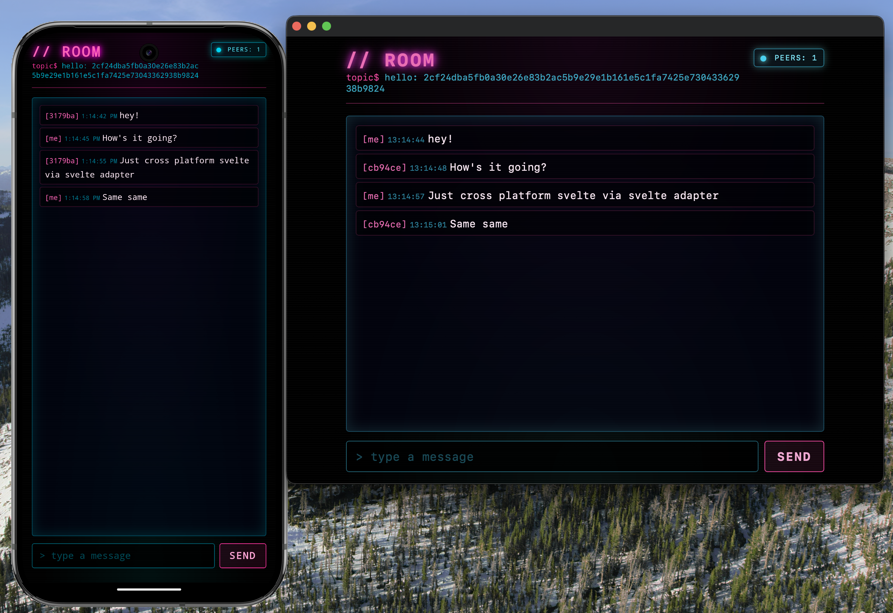

# sveltekit-adapter-bare

> ⚠️ **Highly experimental.** This adapter is a proof of concept for running a SvelteKit app inside the [bare](https://github.com/holepunchto/bare) runtime so it can be packaged with [`bare-build`](https://github.com/holepunchto/bare-build) and rendered in a native window via [`bare-native`](https://github.com/holepunchto/bare-native). Expect rough edges, missing features, and breaking changes.

A SvelteKit [adapter](https://svelte.dev/docs/kit/adapters) that produces a server bundle runnable by `bare` instead of Node.js. The output is a plain `build/` directory you can hand to `bare-build` to produce a single-file, native-windowed app.



Demo: https://github.com/Drache93/bare-svelte-demo

## Install

```sh
npm install --save-dev sveltekit-adapter-bare
```

All bare runtime deps (`bare-http1`, `bare-fs`, `bare-native`, `bare-fetch`, `bare-form-data`, `paparam`, etc.) are pulled in transitively — you don't need to declare them in your own `package.json`.

## Configure

In `svelte.config.js`, swap out your adapter:

```js
import adapter from 'sveltekit-adapter-bare';

/** @type {import('@sveltejs/kit').Config} */
const config = {
	compilerOptions: {
		// Force runes mode for the project, except for libraries. Can be removed in svelte 6.
		runes: ({ filename }) => (filename.split(/[/\\]/).includes('node_modules') ? undefined : true)
	},
	kit: {
		// adapter-auto only supports some environments, see https://svelte.dev/docs/kit/adapter-auto for a list.
		// If your environment is not supported, or you settled on a specific environment, switch out the adapter.
		// See https://svelte.dev/docs/kit/adapters for more information about adapters.
		adapter: adapter(),
		csrf: { checkOrigin: false }
	}
};

export default config;
```

Options:

| option | default   | description                          |
| ------ | --------- | ------------------------------------ |
| `out`  | `'build'` | Directory to emit the server bundle. |

## Build

Three steps — SvelteKit produces the bare-compatible server, `bare-build` links it for a target platform against the `bare-native` runtime, and `bare-build` wraps the result into a native app:

```sh
# 1. Vite build — the adapter emits ./build
npm run build

# 2. Build the native app for the target host/arch using the bare-native runtime
npx bare-build \
  --out build/darwin-arm64 \
  --host darwin-arm64 \
  --runtime bare-native/runtime \
  build/index.js
```

Swap `--host` / `--out` to target a different platform (`linux-x64`, `android-arm64`, etc.).

The emitted entry (`build/index.js`) is a small `paparam` CLI that spins up `bare-http1`, opens a `bare-native` window, and loads `http://localhost:<port>`:

```sh
./build/<platform>/<name>.app --width 800 --height 600 --inspectable
```

Flags:

- `--host` (default `0.0.0.0`) — interface to listen on.
- `--port` (default `0`) — TCP port. `0` asks the OS for a free port; the chosen port is logged at startup and handed to the WebView automatically.
- `--width`, `--height` — native window size.
- `--inspectable` — enable the WebView's remote inspector (connect from desktop Chrome via `chrome://inspect`).

## What the adapter does

- Bundles SvelteKit's server with `esbuild`, aliasing `node:*` builtins to their `bare-*` equivalents.
- Patches out SvelteKit's lazy `obfuscated_import("node:crypto")` fallback — `globalThis.crypto` is assigned at startup from `bare-crypto`.
- Stubs `node:async_hooks` (bare doesn't ship an equivalent; SvelteKit's `AsyncLocalStorage` usage works against a minimal shim).
- Emits an `assets.js` module with one static `import.meta.asset()` call per file in `client/` and `prerendered/`, so `bare-module-traverse` preserves every static asset when `bare-build` bundles the app.
- Polyfills `Request.prototype.formData()` on top of `bare-fetch`, supporting `application/x-www-form-urlencoded` and simple `multipart/form-data` (text fields) so SvelteKit form actions work.

## Known limitations

- `multipart/form-data` file uploads are not implemented (text fields only).
- No HTTPS, no clustering, no compression, no range requests.
- Android not working yet for multi page

## License

Apache-2.0
