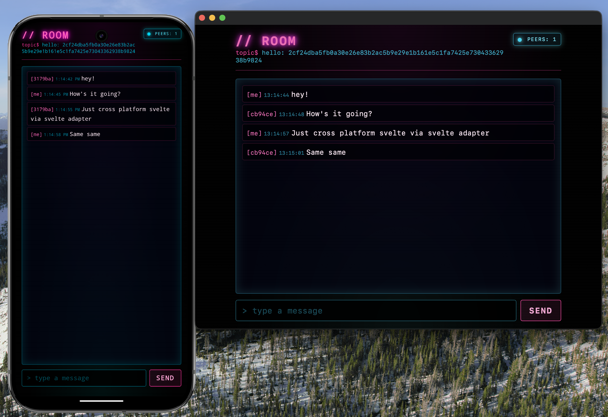

# sveltekit-adapter-bare

> ⚠️ **Highly experimental.** This adapter is a proof of concept for running a SvelteKit app inside the [bare](https://github.com/holepunchto/bare) runtime so it can be packaged with [`bare-build`](https://github.com/holepunchto/bare-build) and rendered in a native window via [`bare-native`](https://github.com/holepunchto/bare-native). Expect rough edges, missing features, and breaking changes.

A SvelteKit [adapter](https://svelte.dev/docs/kit/adapters) that produces a server bundle runnable by `bare` instead of Node.js. The output is a plain `build/` directory you can hand to `bare-build` to produce a single-file, native-windowed app.



Demo: https://github.com/Drache93/bare-svelte-demo

## Install

```sh
npm install --save-dev sveltekit-adapter-bare
```

All bare runtime deps (`bare-http1`, `bare-fs`, `bare-native`, `bare-fetch`, `bare-form-data`, `paparam`, etc.) are pulled in transitively — you don't need to declare them in your own `package.json`.

## Configure

In `svelte.config.js`, swap out your adapter:

```js
import adapter from 'sveltekit-adapter-bare'

/** @type {import('@sveltejs/kit').Config} */
const config = {
  compilerOptions: {
    // Force runes mode for the project, except for libraries. Can be removed in svelte 6.
    runes: ({ filename }) => (filename.split(/[/\\]/).includes('node_modules') ? undefined : true)
  },
  kit: {
    adapter: adapter({
      window: { width: 1200, height: 800, inspectable: false }
    }),
    csrf: { checkOrigin: false }
  }
}

export default config
```

Options:

| option               | default   | description                                     |
| -------------------- | --------- | ----------------------------------------------- |
| `out`                | `'build'` | Directory to emit the server bundle.            |
| `window.width`       | `800`     | Native window width in pixels.                  |
| `window.height`      | `600`     | Native window height in pixels.                 |
| `window.inspectable` | `false`   | Enable the WebView's remote DevTools inspector. |

## Vite plugin

Add `vitePlugin()` to `vite.config.ts` to automatically externalize all `bare-*` packages from Vite's SSR bundler. Without this, Vite tries to bundle native Bare modules and fails.

```ts
import { vitePlugin as bareExternals } from 'sveltekit-adapter-bare'
import { sveltekit } from '@sveltejs/kit/vite'
import { defineConfig } from 'vite'

export default defineConfig({
  plugins: [sveltekit(), bareExternals()],
  ssr: {
    // vitePlugin handles bare-* automatically; add non-bare holepunch packages manually:
    external: ['distributed-drive', 'hyperdb', 'corestore', 'hyperswarm', 'hyperdrive', ...]
  }
})
```

## Android back navigation

On Android, the adapter automatically intercepts the system back gesture/button (via [`bare-navigation-android`](https://github.com/holepunchto/bare-navigation-android)) and calls `history.back()` in the WebView — no app code required.

To intercept the event and run custom logic, listen for the cancelable `bare:back` DOM event in your layout:

```svelte
<!-- src/routes/+layout.svelte -->
<script>
  import { onMount } from 'svelte'
  onMount(() => {
    const handler = (e) => {
      e.preventDefault()
      // custom logic — e.g. show a confirmation dialog before closing
    }
    window.addEventListener('bare:back', handler)
    return () => window.removeEventListener('bare:back', handler)
  })
</script>
```

Calling `e.preventDefault()` suppresses the default `history.back()`. To close the app explicitly use `BackHandler.close()` from `bare-navigation-android`.

> **Manifest requirement**: add `android:enableOnBackInvokedCallback="true"` to your `<application>` tag and set `minSdkVersion` to at least 33. Without the flag, edge-swipe gestures are not intercepted (button presses still work).

## Graceful shutdown and `sveltekit:close`

The adapter fires `sveltekit:close` on process exit (Ctrl-C, SIGTERM, and native window close). Use it to tear down long-lived resources:

```ts
// src/hooks.server.ts
process.on('sveltekit:close', async () => {
  await app?.close()
})
```

**macOS window close caveat**: `AppKitWindow` emits `will-close` but the `NativeWindow` wrapper does not forward it. The adapter hooks `win._native?.on?.('will-close', shutdown)` directly, so Ctrl-X on the window triggers the same clean shutdown as Ctrl-C.

## Build

Three steps — SvelteKit produces the bare-compatible server, `bare-build` links it for a target platform against the `bare-native` runtime, and `bare-build` wraps the result into a native app:

```sh
# 1. Vite build — the adapter emits ./build
npm run build

# 2. Build the native app for the target host/arch using the bare-native runtime
npx bare-build \
  --out build/darwin-arm64 \
  --host darwin-arm64 \
  --runtime bare-native/runtime \
  build/index.js
```

Swap `--host` / `--out` to target a different platform (`linux-x64`, `android-arm64`, etc.).

The emitted entry (`build/index.js`) is a small `paparam` CLI that spins up `bare-http1`, opens a `bare-native` window, and loads `http://localhost:<port>`:

```sh
./build/<platform>/<name>.app --width 800 --height 600 --inspectable
```

Flags:

- `--host` (default `0.0.0.0`) — interface to listen on.
- `--port` (default `0`) — TCP port. `0` asks the OS for a free port; the chosen port is logged at startup and handed to the WebView automatically.
- `--width`, `--height` — native window size (override `window` option from `svelte.config.js`).
- `--inspectable` — enable the WebView's remote inspector (connect from desktop Chrome via `chrome://inspect`).

## What the adapter does

- Bundles SvelteKit's server with `esbuild`, aliasing `node:*` builtins to their `bare-*` equivalents.
- Patches out SvelteKit's lazy `obfuscated_import("node:crypto")` fallback — `globalThis.crypto` is assigned at startup from `bare-crypto`.
- Stubs `node:async_hooks` (bare doesn't ship an equivalent; SvelteKit's `AsyncLocalStorage` usage works against a minimal shim).
- Emits an `assets.js` module with one static `import.meta.asset()` call per file in `client/` and `prerendered/`, so `bare-module-traverse` preserves every static asset when `bare-build` bundles the app.
- Correctly forwards multiple `Set-Cookie` headers using `getSetCookie()` instead of flattening them.

## Known limitations

- `multipart/form-data` file uploads are not implemented (text fields only).
- No HTTPS, no clustering, no compression, no range requests.

## License

Apache-2.0
